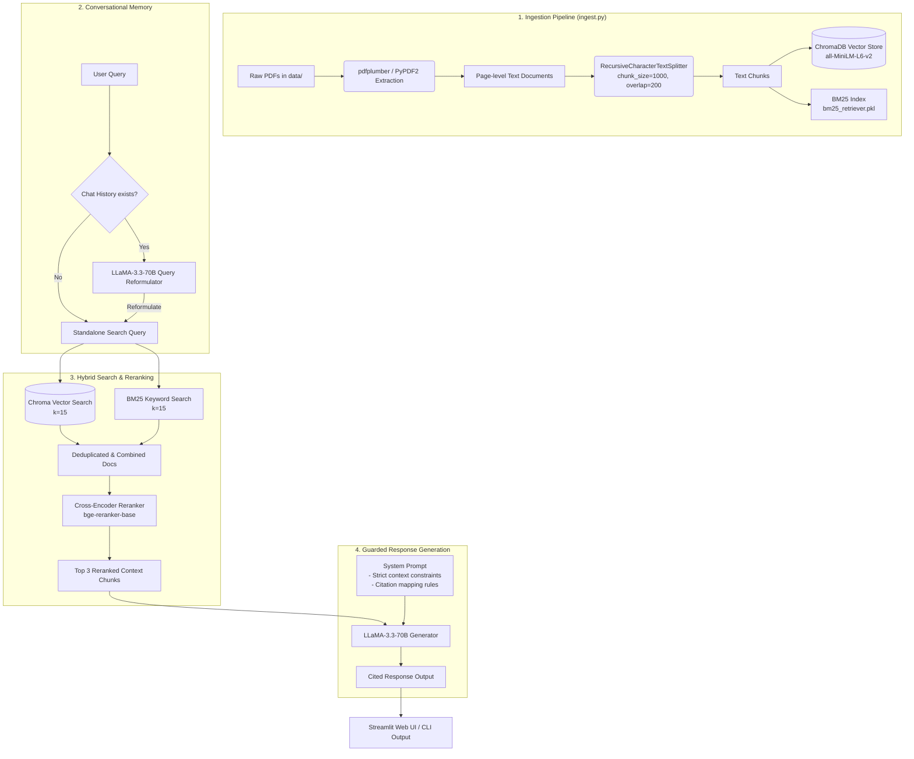

# PetroChat - Oil & Gas Domain RAG Assistant


PetroChat is a domain-specific Retrieval-Augmented Generation (RAG) system tailored for the Oil & Gas industry. It assists petroleum engineers and safety officers by providing precise, context-enforced, and cited answers to operational questions regarding drilling, production, well control, and process safety standards (such as OSHA guidelines, API recommended practices, and BLM onshore orders).

---


## 🚀 Key Features

* **Hybrid Document Search**: Integrates semantic vector search (ChromaDB + `all-MiniLM-L6-v2`) and keyword search (Rank-BM25) to achieve high recall and precision.
* **Cross-Encoder Re-ranking**: Employs a Cross-Encoder model (`BAAI/bge-reranker-base`) to score and select the top 3 most relevant context chunks out of 30 initial candidates.
* **Strict Guardrails & Hallucination Prevention**: Enforces a strict system prompt instructing LLaMA-3.3-70B to rely solely on the retrieved documents. If the answer cannot be found in the context, it returns the standard message: `"I cannot answer this question based on the provided documents."`
* **Conversational Memory**: Automatically reformulates follow-up queries using the last 3 turns of chat history, maintaining topic continuity in conversational mode.
* **Page-Level Standard Citations**: Automatically maps document filenames to their respective international engineering standards, generating citations in standard formatting after every factual claim (e.g. `[API RP 54 (Well Drilling and Servicing Safety), Page 56]`).
* **Sleek Streamlit Interface**:
  * **Sidebar Analytics**: Displays total ingested document count, chunk count, file size, and chunk distribution.
  * **Interactive Quick Prompts**: Suggests common engineering and safety queries to get started quickly.
  * **Typing Animation**: Simulates AI typing with a blink cursor effect for a premium user experience.
  * **Source Explorer**: Uses expandable cards showcasing re-rank confidence scores and exact text chunks.
  * **Conversation PDF Export**: Allows downloading full conversational transcripts (including user queries, AI responses, citations, and re-ranked source scores) as formatted PDF documents.
  * **Multi-Document Ingestion & Management**: Enables drag-and-drop uploading of multiple PDF files directly from the UI sidebar, with automated real-time parsing, text chunking, embedding generation, indexing, and the option to delete documents with immediate database re-indexing or complete wiping.

---

## 🏗️ Architecture Diagram

The diagram below details the ingestion, retrieval, reranking, and generation pipeline of PetroChat:



---

## 🛠️ Installation & Setup

Follow these steps to set up and run the PetroChat application on your local machine:

### 1. Clone the Repository
```bash
git clone https://github.com/amalcrypt/petrochat.git
cd petrochat
```

### 2. Create and Activate a Virtual Environment
It is highly recommended to use a virtual environment to manage dependencies:
* **On Windows (PowerShell)**:
  ```powershell
  python -m venv venv
  .\venv\Scripts\Activate.ps1
  ```
* **On Windows (Command Prompt)**:
  ```cmd
  python -m venv venv
  .\venv\Scripts\activate.bat
  ```
* **On macOS/Linux**:
  ```bash
  python3 -m venv venv
  source venv/bin/activate
  ```

### 3. Install Dependencies
Install all required libraries specified in `requirements.txt`:
```bash
pip install -r requirements.txt
```

### 4. Configure Environment Variables
Create a `.env` file in the root directory of the project and specify your Groq API key:
```env
GROQ_API_KEY=your_groq_api_key_here
```

### 5. Add Knowledge PDFs
Place all petroleum engineering and process safety standard PDF documents inside the `data/` directory.

---

## 📂 Citation & Sidebar Mapping

To prevent raw file names from appearing in citations and to display standard names in the UI sidebar, the system maps document filenames to their official international titles:

| Ingested Filename | International Standard / Document Title | Example Citation Format |
| :--- | :--- | :--- |
| `api_rp54_drilling_safety.pdf` | API RP 54 (Well Drilling and Servicing Safety) | `[API RP 54, Page 12]` |
| `osha_3843_tank_gauging.pdf` | OSHA 3843 (Safe Tank Gauging) | `[OSHA 3843, Page 5]` |
| `osha_3918_psm_refinery.pdf` | OSHA 3918 (Refinery Process Safety Management) | `[OSHA 3918, Page 19]` |
| `blm_drilling_operations.pdf` | BLM Onshore Order No. 2 (43 CFR 3160) | `[BLM Onshore Order No. 2, Page 3]` |
| `abb_production_handbook.pdf` | ABB Oil & Gas Production Handbook | `[ABB Oil & Gas Production Handbook, Page 36]` |
| `osha_steps_citations.pdf` | OSHA Steps Alliance Citation Guide | `[OSHA Steps Citation Guide, Page 2]` |

---

## 🖥️ Running the Application

### 1. Ingest Knowledge PDFs
Run the ingestion script to parse the PDF documents, split them into chunks, generate embeddings, and build the search indexes:
```bash
python ingest.py
```
*To wipe the existing database and force re-ingestion, use the `--force` flag:*
```bash
python ingest.py --force
```

### 2. Launch the Streamlit Web UI
Run the Streamlit application to start the web-based interactive chat interface:
```bash
streamlit run app.py
```

### 3. Run Interactive CLI Chat
Run the conversational interface directly in your terminal:
```bash
python petrochat.py
```
* **Type `clear`** to reset the conversation history.
* **Type `exit`, `quit`, or `q`** to close the session.

### 4. Run Single-Shot CLI Query
Execute a single query directly from the terminal without entering conversational mode:
```bash
python petrochat.py --query "What are the OSHA requirements for tank gauging?"
```

### 5. Run Automated Tests
Execute the automated test suite to run 10 complex domain-specific queries against the RAG system and log the results into `qa_log.md`:
```bash
python run_tests.py
```

---

## 📂 Project Structure

```text
petrochat/
├── .streamlit/
│   └── config.toml          # Streamlit UI configuration (themes, ports)
├── assets/
│   └── petrochat_ui_mockup.png # Web application screenshot
├── data/
│   ├── sessions/            # Saved chat sessions in JSON format
│   └── [PDF Documents]      # Raw engineering standards and safety manuals
├── chroma_db/               # Persisted ChromaDB vector database directory
├── app.py                   # Streamlit web application interface and styling
├── petrochat.py             # Core RAG pipeline, LLM generation, & CLI modes
├── ingest.py                # Document parsing, chunking, and embedding
├── run_tests.py             # Automated test runner suite
├── requirements.txt         # Package dependencies
├── .env                     # Environment configurations (Groq API Key)
├── qa_log.md                # Output log of the automated test runner
└── petrochat_session.log    # Audit log of user queries and generated answers
```

---

## 🐳 Docker Containerization

You can package and run PetroChat using Docker. The Dockerfile pre-downloads and caches the local machine learning models (embeddings and reranker) during the image build process for faster runtime start times.

### 1. Build the Docker Image
Build the Docker image from the root directory of the project:
```bash
docker build -t petrochat:latest .
```

### 2. Run the Container
Run the container and expose the Streamlit port `7860`. Pass your `GROQ_API_KEY` as an environment variable:
```bash
docker run -d -p 7860:7860 -e GROQ_API_KEY="your_groq_api_key_here" --name petrochat petrochat:latest
```

### 3. Persistent Storage (Optional)
To persist uploaded documents and chat sessions across container restarts, mount your local `data` and `chroma_db` directories:
```bash
docker run -d -p 7860:7860 \
  -e GROQ_API_KEY="your_groq_api_key_here" \
  -v "$(pwd)/data:/app/data" \
  -v "$(pwd)/chroma_db:/app/chroma_db" \
  --name petrochat petrochat:latest
```

Access the application in your browser at `http://localhost:7860`.

---

## 🛡️ License & Attributions

This project is built for the Oil & Gas industry using open-source models:
* **Embeddings**: SentenceTransformers `all-MiniLM-L6-v2`
* **Reranker**: Cross-Encoder `BAAI/bge-reranker-base`
* **Large Language Model**: LLaMA-3.3-70B via Groq API
* **Vector Store**: ChromaDB
* **UI Framework**: Streamlit

