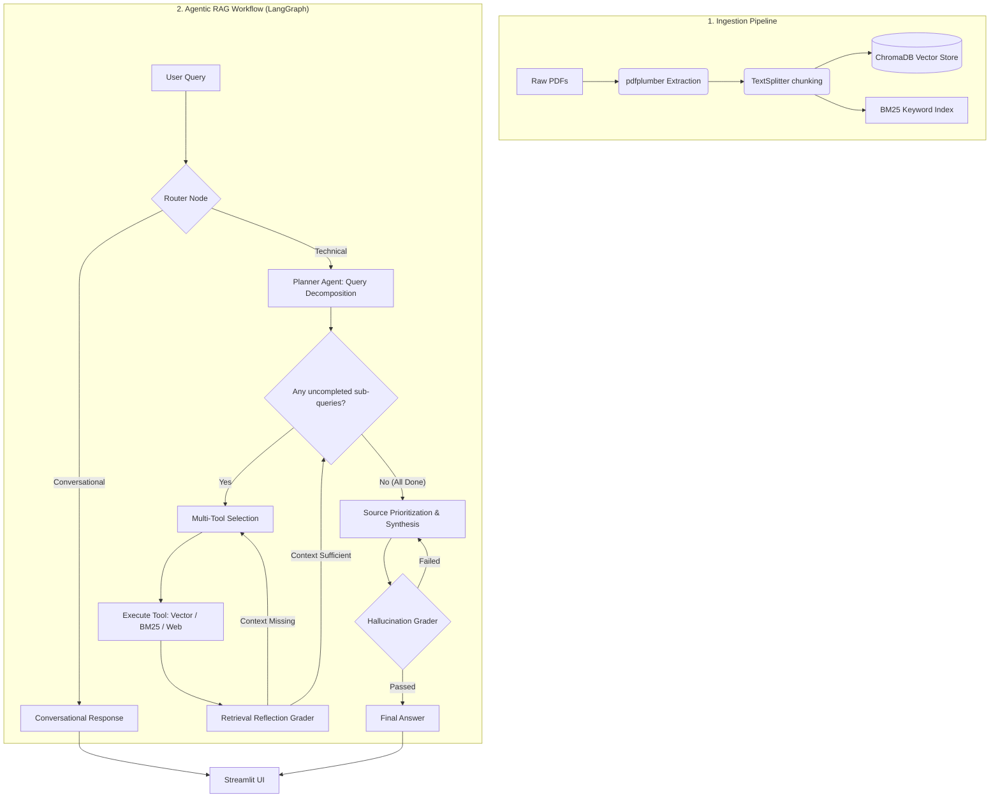

# PetroChat - Agentic Oil & Gas RAG Assistant


PetroChat is a domain-specific Retrieval-Augmented Generation (RAG) system tailored for the Oil & Gas industry. It assists petroleum engineers and safety officers by providing precise, context-enforced, and cited answers to operational questions regarding drilling, production, well control, and process safety standards (such as OSHA guidelines, API recommended practices, and BLM onshore orders).

---


## 🚀 Key Features

* **Plan-and-Execute Agent Workflow**: Powered by LangGraph, PetroChat uses an active state machine to reason about queries rather than a static pipeline.
* **Intelligent Query Routing**: The agent decides if a query requires technical document retrieval or is a simple conversational greeting, saving compute and improving response time.
* **Planner Agent & Query Decomposition**: For complex or multi-part questions, the agent breaks the prompt down into a series of smaller, independent sub-queries to execute iteratively.
* **Multi-Tool Selection**: The agent dynamically selects the best search tool for each specific sub-query (Semantic Vector Search, BM25 Keyword Search, or Web Search).
* **Retrieval Reflection**: After searching, the agent actively reads the retrieved documents and grades their relevance. If local context is missing for a step, it autonomously triggers a Web Search fallback to fill the gap.
* **Source Prioritization & Synthesis**: When combining answers from multiple tools, the agent explicitly prioritizes official internal Standards (API, OSHA, BLM, Handbooks) as the ground truth over web search results.
* **Hybrid Document Search**: Integrates semantic vector search (ChromaDB + `all-MiniLM-L6-v2`) and keyword search (Rank-BM25) to achieve high recall and precision.
* **Agentic Routing over Re-ranking**: Eliminates the need for slow, heavy Cross-Encoder reranking models by dynamically routing queries to targeted databases and leveraging native LLM reasoning to extract relevant context.
* **Self-Correction & Hallucination Guardrails**: The agent acts as its own critic, evaluating draft answers to ensure they are strictly grounded in context and properly resolve the user's question. It loops and retries if it hallucinates.
* **Conversational Memory**: Automatically reformulates follow-up queries using the last 3 turns of chat history, maintaining topic continuity in conversational mode.
* **Page-Level Standard Citations**: Automatically maps document filenames to their respective international engineering standards, generating citations in standard formatting after every factual claim (e.g. `[API RP 54 (Well Drilling and Servicing Safety), Page 56]`).
* **Sleek Streamlit Interface**:
  * **Sidebar Analytics**: Displays total ingested document count, chunk count, file size, and chunk distribution.
  * **Interactive Quick Prompts**: Suggests common engineering and safety queries to get started quickly.
  * **Typing Animation**: Simulates AI typing with a blink cursor effect for a premium user experience.
  * **Source Explorer**: Uses expandable cards showcasing re-rank confidence scores and exact text chunks.
  * **Conversation PDF Export**: Allows downloading full conversational transcripts (including user queries, AI responses, citations, and re-ranked source scores) as formatted PDF documents.
  * **Multi-Document Ingestion & Management**: Enables drag-and-drop uploading of multiple PDF files directly from the UI sidebar, with automated real-time parsing, text chunking, embedding generation, indexing, and the option to delete documents with immediate database re-indexing or complete wiping.

---

## 🏗️ Architecture Diagram

The diagram below details the ingestion, Agentic LangGraph workflow, and generation pipeline of PetroChat:



---

## 🛠️ Installation & Setup

Follow these steps to set up and run the PetroChat application on your local machine:

### 1. Clone the Repository
```bash
git clone https://github.com/amalcrypt/petrochat.git
cd petrochat
```

### 2. Create and Activate a Virtual Environment
It is highly recommended to use a virtual environment to manage dependencies:
* **On Windows (PowerShell)**:
  ```powershell
  python -m venv venv
  .\venv\Scripts\Activate.ps1
  ```
* **On Windows (Command Prompt)**:
  ```cmd
  python -m venv venv
  .\venv\Scripts\activate.bat
  ```
* **On macOS/Linux**:
  ```bash
  python3 -m venv venv
  source venv/bin/activate
  ```

### 3. Install Dependencies
Install all required libraries specified in `requirements.txt`:
```bash
pip install -r requirements.txt
```

### 4. Configure Environment Variables
Create a `.env` file in the root directory of the project and specify your Groq API key:
```env
GROQ_API_KEY=your_groq_api_key_here
```

### 5. Add Knowledge PDFs
Place all petroleum engineering and process safety standard PDF documents inside the `data/` directory.

---

## 📂 Citation & Sidebar Mapping

To prevent raw file names from appearing in citations and to display standard names in the UI sidebar, the system maps document filenames to their official international titles:

| Ingested Filename | International Standard / Document Title | Example Citation Format |
| :--- | :--- | :--- |
| `api_rp54_drilling_safety.pdf` | API RP 54 (Well Drilling and Servicing Safety) | `[API RP 54, Page 12]` |
| `osha_3843_tank_gauging.pdf` | OSHA 3843 (Safe Tank Gauging) | `[OSHA 3843, Page 5]` |
| `osha_3918_psm_refinery.pdf` | OSHA 3918 (Refinery Process Safety Management) | `[OSHA 3918, Page 19]` |
| `blm_drilling_operations.pdf` | BLM Onshore Order No. 2 (43 CFR 3160) | `[BLM Onshore Order No. 2, Page 3]` |
| `abb_production_handbook.pdf` | ABB Oil & Gas Production Handbook | `[ABB Oil & Gas Production Handbook, Page 36]` |
| `osha_steps_citations.pdf` | OSHA Steps Alliance Citation Guide | `[OSHA Steps Citation Guide, Page 2]` |

---

## 🖥️ Running the Application

### 1. Ingest Knowledge PDFs
Run the ingestion script to parse the PDF documents, split them into chunks, generate embeddings, and build the search indexes:
```bash
python ingest.py
```
*To wipe the existing database and force re-ingestion, use the `--force` flag:*
```bash
python ingest.py --force
```

### 2. Launch the Streamlit Web UI
Run the Streamlit application to start the web-based interactive chat interface:
```bash
streamlit run app.py
```

### 3. Run Interactive CLI Chat
Run the conversational interface directly in your terminal:
```bash
python petrochat.py
```
* **Type `clear`** to reset the conversation history.
* **Type `exit`, `quit`, or `q`** to close the session.

### 4. Run Single-Shot CLI Query
Execute a single query directly from the terminal without entering conversational mode:
```bash
python petrochat.py --query "What are the OSHA requirements for tank gauging?"
```

### 5. Run Automated Tests
Execute the automated test suite to run 10 complex domain-specific queries against the RAG system and log the results into `qa_log.md`:
```bash
python run_tests.py
```

### 6. Run Accuracy Evaluation
Execute the Ground Truth Evaluation script, which uses an LLM-as-a-Judge to score the Agent's answers for semantic correctness, hallucination prevention, and proper citation usage. Results are output to `evaluation_report.md`:
```bash
python evaluate.py
```

---

## 📂 Project Structure

```text
petrochat/
├── .streamlit/
│   └── config.toml          # Streamlit UI configuration (themes, ports)
├── assets/
│   └── petrochat_ui_mockup.png # Web application screenshot
├── data/
│   ├── sessions/            # Saved chat sessions in JSON format
│   └── [PDF Documents]      # Raw engineering standards and safety manuals
├── chroma_db/               # Persisted ChromaDB vector database directory
├── app.py                   # Streamlit web application interface and styling
├── petrochat.py             # CLI mode entry points and overall logic
├── agentic_graph.py         # LangGraph state machine (Router, Graders, Tools)
├── ingest.py                # Document parsing, chunking, and embedding
├── run_tests.py             # Automated test runner suite
├── evaluate.py              # LLM-as-a-judge accuracy evaluation script
├── requirements.txt         # Package dependencies
├── .env                     # Environment configurations (Groq API Key)
├── qa_log.md                # Output log of the automated test runner
└── petrochat_session.log    # Audit log of user queries and generated answers
```

---

## 🐳 Docker Containerization

You can package and run PetroChat using Docker. The Dockerfile pre-downloads and caches the local machine learning embeddings model during the image build process for faster runtime start times.

### 1. Build the Docker Image
Build the Docker image from the root directory of the project:
```bash
docker build -t petrochat:latest .
```

### 2. Run the Container
Run the container and expose the Streamlit port `7860`. Pass your `GROQ_API_KEY` as an environment variable:
```bash
docker run -d -p 7860:7860 -e GROQ_API_KEY="your_groq_api_key_here" --name petrochat petrochat:latest
```

### 3. Persistent Storage (Optional)
To persist uploaded documents and chat sessions across container restarts, mount your local `data` and `chroma_db` directories:
```bash
docker run -d -p 7860:7860 \
  -e GROQ_API_KEY="your_groq_api_key_here" \
  -v "$(pwd)/data:/app/data" \
  -v "$(pwd)/chroma_db:/app/chroma_db" \
  --name petrochat petrochat:latest
```

Access the application in your browser at `http://localhost:7860`.

---

## 🛡️ License & Attributions

This project is built for the Oil & Gas industry using open-source models:
* **Embeddings**: SentenceTransformers `all-MiniLM-L6-v2`
* **Large Language Model**: LLaMA-3.3-70B via Groq API
* **Vector Store**: ChromaDB
* **UI Framework**: Streamlit

